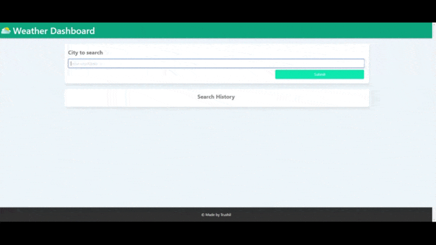

# Weather Dashboard

## 📖Table of Contents
1. [Description](#description)
2. [Link](#Link)
3. [Screenshots](#Screenshots)
4. [Technologies](#Technologies)
5. [Contributing](#Contributing)
6. [Author](#Author)
7. [License](#License)

## Description
A weather dashboard that can retrieve weather data for the city inputted by the user.

The current days weather is displayed as well as the forecast for the next five days.

Recent searches are saved in the search history at the bottom of the page.

## Link
The link to the deployed application:

Weather Dashboard: https://trushilbudhia.github.io/Weather-Dashboard/

## Screenshots
The following image shows the web application's appearance:

> **Note**: This layout is responsive.

## Technologies
- JavaScript
- HTML
- CSS
- [Bulma](https://bulma.io/)
- [OpenWeather Weather API](https://openweathermap.org/current)
- [OpenWeather OneCall API](https://openweathermap.org/api/one-call-api)
- [Google Places API](https://developers.google.com/maps/documentation/places/web-service/overview)

## Contributing
Contributions, issues and feature requests are welcome.

Feel free to check [issues page](https://github.com/TrushilBudhia/Weather-Dashboard/issues) if you want to contribute.

## Author
👤Trushil Budhia
- Github: [@Trushil](https://github.com/TrushilBudhia)
- Email: trushil.budhia@gmail.com

## License
Copyright © 2021 [Trushil](https://github.com/TrushilBudhia)

This project is [MIT](./LICENSE.md) licensed