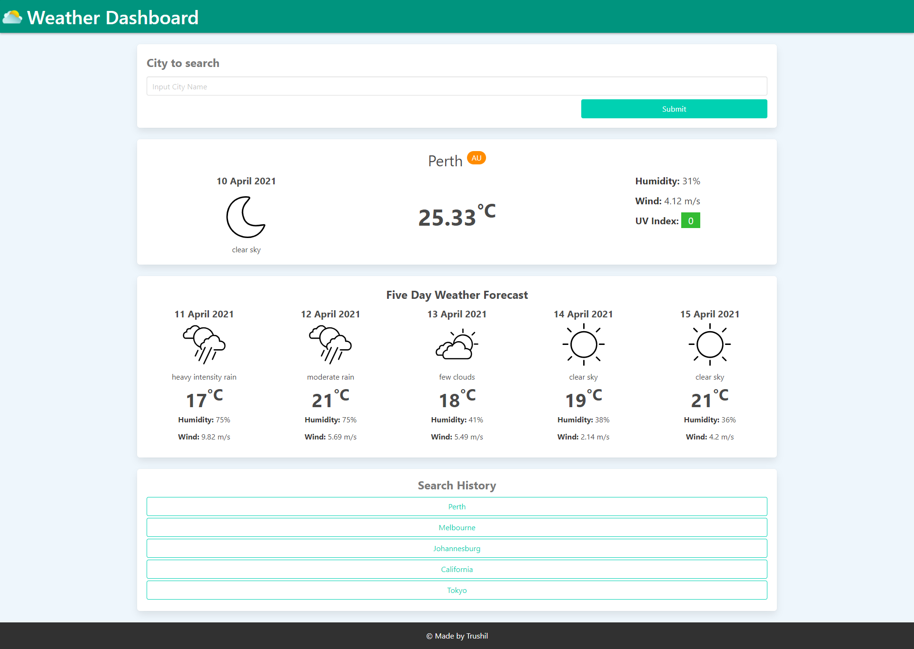

# Weather-Dashboard

## Description

A weather dashboard that can retrieve weather data for the city inputted by the user.

The current days weather is displayed as well as the forecast for the next five days.

Recent searches are saved in the search history at the bottom of the page.

## Link

The link to the deployed application:

Weather Dashboard: https://trushilbudhia.github.io/Weather-Dashboard/

## Assets

The CSS Framework used is Bulma. 

The following image shows the web application's appearance:

> **Note**: This layout is responsive.